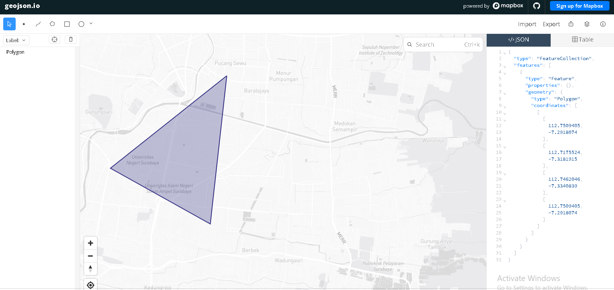

---
jupytext:
  text_representation:
    extension: .md
    format_name: myst
    format_version: 0.13
---

# Data Understanding

Langkah pertama dalam proyek ini adalah mengumpulkan data polutan udara seperti $NO_2$, $CO$, dan $SO_2$ yang berjenis deret waktu (Time Series). Data tersebut diambil dari platform satelit [Copernicus Data Space Ecosystem](https://openeo.dataspace.copernicus.eu).

Buat akun terlebih dahulu di website Copernicus sebelum melakukan *crawling* data menggunakan library `openEO`.

## Install Library

Sebelum melakukan proses *crawling* data, kita membutuhkan modul Python pendukung seperti `openeo` untuk berkomunikasi dengan API Copernicus dan `pandas` untuk membaca format data tabular csv/dataframe.

```bash
pip install openeo
pip install pandas
```

## Autentikasi dan Pengambilan Data

Skrip di bawah ini melakukan proses autentikasi dan menghubungkan akun lokal kita dengan server Copernicus menggunakan metode OIDC:

```python
import openeo

connection = openeo.connect("[https://openeo.dataspace.copernicus.eu](https://openeo.dataspace.copernicus.eu)").authenticate_oidc()
```

Saat menjalankan kode di atas akan muncul pesan autentikasi:

> **Note**: Authenticated using refresh token.  
> Authenticated successfully.

Klik tautan tersebut lalu login menggunakan akun Copernicus.

## Definisi Area dan Pengambilan Data $NO_2$, $CO$, dan $SO_2$ dari GeoJSON

Setelah berhasil, langkah selanjutnya adalah menentukan wilayah spesifik. Titik koordinat wilayah (batasan polygon) didapatkan menggunakan alat bantu pemetaan [geojson.io](https://geojson.io) dengan menggambar lokasi area studi yang diinginkan lalu meng-copy koordinatnya.



Koordinat yang didapatkan dimasukkan ke dalam variabel `spatial_extent` dan eretan rentang data yang diinginkan. Lalu memuat koleksi polutan berdasarkan *bounding box* wilayah tersebut dengan menyesuaikan variabel *temporal_extent* dan *bands*.

Karena satelit merekam per-area yang sama beberapa kali, dilakukan agregasi temporal harian agar hanya mendapat rata-rata data per hari. Dilanjutkan dengan agregasi spasial guna menghitung rata-rata nilai polutan seluruh grid pada wilayah koordinat tersebut menjadi satu nilai tunggal:

```python
# Koordinat area observasi dari GeoJSON
aoi = {
    "type": "FeatureCollection",
    "features": [
        {
            "type": "Feature",
            "geometry": {
                "type": "Polygon",
                "coordinates": [
                    [
                        [112.7500405, -7.2918074],
                        [112.7175524, -7.3181015],
                        [112.7462846, -7.3340839],
                        [112.7500405, -7.2918074]
                    ]
                ]
            }
        }
    ]
}

# Load Data Cube openEO untuk Sentinel-5P NO2
datacube = connection.load_collection(
    "SENTINEL_5P_L2",
    temporal_extent=["2025-09-01", "2026-08-31"],
    spatial_extent={"west": 112.71, "south": -7.33, "east": 112.75, "north": -7.29},
    bands=["NO2"]
)

# Agregasi temporal harian
datacube = datacube.aggregate_temporal_period(reducer="mean", period="day")

# Agregasi spasial rata-rata area polygon
datacube = datacube.aggregate_spatial(reducer="mean", geometries=aoi)
```

## Eksekusi Job dan Download

Proses agregasi data ini membutuhkan waktu sehingga dikirim sebagai *batch job*:

```python
job = datacube.execute_batch(title="NO2 Data Extraction", outputfile="no2_raw.nc")
```

Tunggu proses eksekusi dari server, progress eksekusi bisa dipantau pada *output Editor*. Setelah diproses oleh server, unduhan data akhir akan berupa file NetCDF (`no2_raw.nc`).